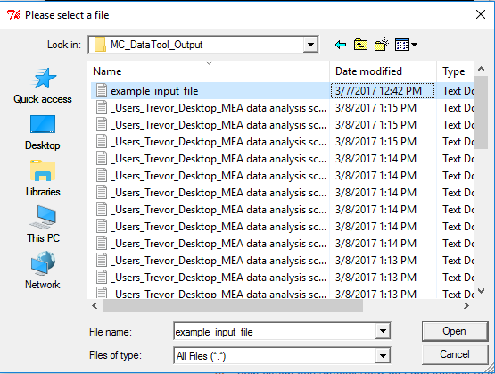

# HSL_DEV

## Overview
This repo contains python scripts for analyzing MEA electrophysiology data.

Please generate issues in github (here) or email max (jackson.max.e@gmail.com) to report errors, difficulties, comments, and requests. 

## Installation
Download and install Anaconda for Python 2.7, found here: https://www.continuum.io/downloads

Download this repository and unzip it in your directory of choice. 

Double-click on setup.bat to run the setup batch file. 

## Usage
To use these scripts, double click on their associated batch file. Alternatively, open a command line in the script's directory and enter `python script_name.py`. 
For example, to use CV_dev.py, enter `python CV_dev.py`.

Note that these analysis scripts currently analyze text files generated by MC_DataTool - before analyzing a file, be sure to generate its text file via mcd_datatool_gen.bat. 

### QT Intervals
To run the QT interval script, double-click the 'QT_Dev.bat' batch file.
 

This will open up a dialog to select a file.
The converted files available will be in the MC_DataTool_Output folder.  
 

Select an input file.  
 

The script will then analyze all spikes across the channels and display the average spikes for review.
 

Enter the electrodes you would like to analyze for their QT interval. Press enter to proceed.
 

The first row plots the average spikes for the selected channel. The second row plots all spikes for the channel. 
On the first row, click and drag to select the QT interval. The third row will update to display your selection.
 

Press enter to confirm your selection. The average QT interval is displayed in the terminal. If you entered multiple channels, the script will continue to the next channel. 
 

### Conduction Velocity
To run the conduction velocity script, double-click the 'CV_dev.bat' batch file. 
 

This will open up a dialog to select a file.
The converted files available will be in the MC_DataTool_Output folder.  
 

Select an input file.  
 

The script will then analyze all spikes across the channels and display the average spikes for review.
 

In the command line, enter the two channels you want to analyze for conduction velocity and press enter.
 

The script will plot the two channels on top of each other in the first row and the stimulation channel(if it exists) in the second row. 
Click and drag to select a region in which to calculate conduction velocity. The region for the two channels will update in the bottom two rows based on your selection.
 

Press enter to confirm your selection and to calculate conduction velocity. The average conduction velocity between the two channels in the region you selected is displayed in the terminal.
 

### spike_PCA_dev.py 
Analyzes and graphs spike features. The user selects a file and the channels to analyze within that file. The script generates and saves full MEA plots of voltage data, then spike PCA plots for each individual channel. 

### mcd_datatool_gen.py 
Generates bulk conversion scripts for MC DataTool. The user selects a folder, then the script generates a conversion script for MC_Datatool to convert all of the .mcd files in the folder and its subfolders. 

The script then generates a batch file that runs MC_DataTool with the generated conversion file. Run this batch file to convert the files you selected. 

The text files generated are placed in an 'Output' folder in the script's local directory. 
